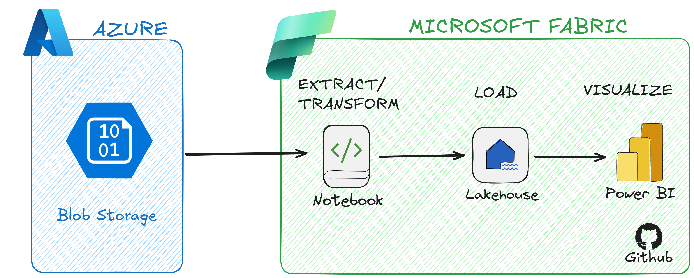

# Building a pipeline with Microsoft Fabric


## Project Overview
This project demonstrates an ETL (Extract, Transform, Load) pipeline using Microsoft Fabric. The pipeline ingests sales data from Azure Blob Storage, performs data cleaning and transformation using a Fabric Notebook (PySpark), and loads the processed data into a Lakehouse. Finally, a semantic model is created and visualized in Power BI.

The goal of this project is to transform raw, inconsistent data into a clean and structured dataset ready for business analysis and reporting.

---

## Business Context
The company **TechRetail Angola & Portugal** operates in the technology retail sector, selling products such as laptops, accessories, and peripherals.

However, the company faces several data challenges:

- Duplicate records  
- Missing values  
- Inconsistent formats  
- Unstructured data  

These issues lead to unreliable reports and poor decision-making.

---

## Project Architecture


---

## Technologies Used

- Storage: Azure Blob Storage  
- Platform: Microsoft Fabric  
- Processing: PySpark (Fabric Notebook)  
- Storage Layer: Lakehouse  
- Visualization: Power BI  

---

## ETL Pipeline Breakdown

### 1. Data Extraction
Sales data is stored in Azure Blob Storage and ingested into a Fabric Notebook.

The dataset includes:
- id_venda  
- cliente  
- produto  
- quantidade  
- preco  
- cidade  
- data
-  
```
storage_account_name = "seu_storage"
container_name = "seu_container"
access_key = "sua_chave"

spark.conf.set(
    f"fs.azure.account.key.{storage_account_name}.blob.core.windows.net",
    access_key
)
```

```
file_path = f"wasbs://{container_name}@{storage_account_name}.blob.core.windows.net/seu_arquivo.csv"
```
---

### 2. Data Transformation

Data is cleaned and transformed using PySpark inside the Fabric Notebook.

Key transformations include:

- Handling missing values (nulls)  
- Removing duplicate records  
- Renaming columns for clarity  
- Dropping unnecessary columns  
- Converting data types (e.g., string to date)  
- Standardizing text fields  
- Creating new columns (e.g., total sales value)  

---

### 3. Data Loading

The transformed dataset is stored in a Lakehouse table using Delta format.

This ensures:
- Optimized performance  
- Structured storage  
- Readiness for analytics  

---

### 4. Data Analysis

A semantic model is created on top of the Lakehouse data and connected to Power BI.

The dashboard includes:

- Total sales  
- Sales by month  
- Sales by city  
- Top customers  

---

## How to Run the Project

### 1. Prerequisites

- Azure Storage Account (Blob Storage)  
- Microsoft Fabric account  
- Power BI access  

---

### 2. Setup Instructions

1. Open the dataset to Azure Blob Storage  
2. Open Microsoft Fabric  
3. Create a new Notebook  
4. Load the dataset using PySpark  
5. Apply transformations  
6. Save data into the Lakehouse  
7. Create a semantic model  
8. Connect Power BI and build the dashboard
9. Versioning and synchronizing in a GitHub repository

---

## Dataset

The dataset used in this project simulates real-world sales data and includes intentional data quality issues such as:

- Missing values  
- Duplicate records  
- Irrelevant columns  

This allows realistic demonstration of data cleaning and transformation processes.

---

## Results

After applying the ETL pipeline, the data becomes:

- Clean  
- Structured  
- Reliable  

This enables accurate reporting and better decision-making through Power BI dashboards.

---

## Future Improvements

- Implement Medallion Architecture (Bronze, Silver, Gold)  
- Automate pipeline with Data Factory / Fabric Pipelines  
- Add real-time data ingestion  
- Improve data validation and monitoring  

---

## Author

**Shalom André**  
Microsoft Student Ambassador  

---

## Final Note

Transforming raw data into actionable insights is key to modern data-driven organizations.

